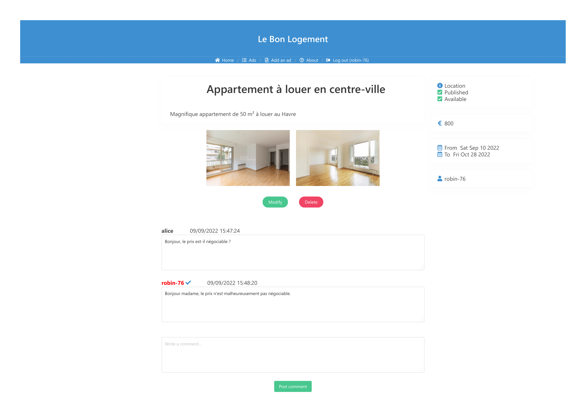

- Year : M2 IWOCS
- Subject : WEB
- TP : n°1

## Author(s)

|Nom|Prénom|
|--|--|
| *Guyomar* | *Robin*|
| *Bourgeaux* | *Maxence*|

# Description

Creation of a real estate ad management website using Express.js and MongoDB technologies.

This site allows to create and display different ads. Here are the available features:
- Basic account creation
- Login

If you are not logged in :
- Only look at the list of ads

If you are logged in but you are a customer :
- Post a comment on a particular ad (ask a question for example)

If you are a real estate agent (box to be chosen when creating your account) :
- Create an ad :
    - Title
    - Description
    - Photos (optional)
    - Price
    - Availability date
    - Property type
    - Property status
    - Publication status
- Modify the ad
- Delete the ad
- Post a comment on a particular ad (to answer a question for example)

# Commands to launch the server
Go to the directory :

    cd Web_TP1

Installing the dependencies :

    npm i

Launch the server :

    npm start

Server link : http://localhost:3000

To check the database :

In a new terminal,

    mongo

    show dbs

    use LeBonLogement

    show collections

Display the created ads :

    db.ads.find().pretty()

Show created users :

    db.users.find().pretty()

View created sessions:

    db.sessions.find().pretty() 

View user comments :

    db.comments.find().pretty()

# Screenshots

Sign up :

Login :

Home :

Form :

Ads :

Ad :

About :

